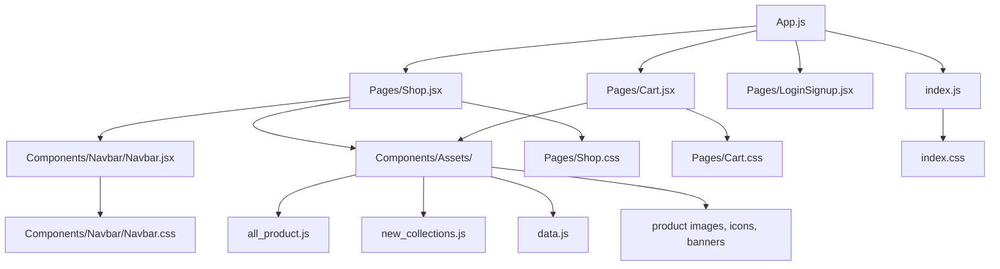
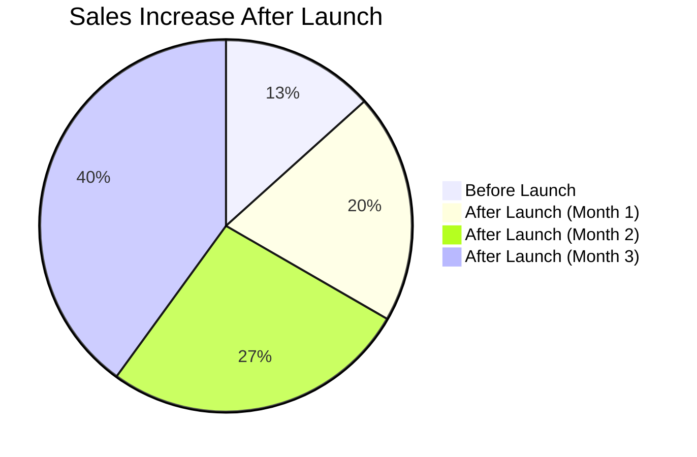

# CandyBliss Frontend

## Overview
CandyBliss is a modern, responsive e-commerce frontend for a handcrafted chocolate brand. Built with React, it features a dynamic product catalog, interactive cart, WhatsApp-based checkout, and a beautiful, mobile-friendly design. The project is structured for scalability and maintainability, with clear separation of concerns and reusable components.

---

## Features
- **Fully Responsive Design:** All pages and components adapt seamlessly to mobile, tablet, and desktop screens.
- **Mobile-Optimized Cart:** The cart page features an adaptive header, touch-friendly controls, and a grid layout that collapses perfectly on small screens. No more overlapping or excessive padding—everything is visually consistent and easy to use on any device.
- **Dynamic Product Catalog:** Browse and add products with images, descriptions, and prices.
- **WhatsApp Checkout:** One-tap checkout via WhatsApp for fast, personalized order handling.
- **Modern UI/UX:** Clean, attractive design with smooth transitions and accessibility in mind.

---

## Project Structure

```plaintext
src/
  App.js                # Main app logic and routing
  index.js              # Entry point
  index.css             # Global styles
  Components/
    Navbar/
      Navbar.jsx        # Responsive navigation bar
      Navbar.css        # Navbar styles
    Assets/             # Product images, icons, and data
      all_product.js
      new_collections.js
      data.js
      ...
  Pages/
    Shop.jsx            # Main shop page (product listing, sections)
    Shop.css            # Shop page styles
    Cart.jsx            # Cart page (cart logic, WhatsApp checkout)
    Cart.css            # Cart page styles
    LoginSignup.jsx     # Login/signup page
  Context/              # (For future state management)
  ...
```

### Visual Structure



---

## How It Works

### 1. **Navigation & Routing**
- Uses React Router for seamless navigation between Shop, Cart, and Login/Signup pages.
- Responsive Navbar adapts to mobile and desktop, with a hamburger menu for small screens.

### 2. **Product Catalog (Shop Page)**
- Displays a curated list of chocolate products with images, descriptions, and prices.
- Users can add products to the cart directly from the shop page.
- Sections for About, Contact, and more, all accessible without page reloads.

### 3. **Cart Functionality**
- Cart state is managed in the top-level App component and passed down as props.
- Users can update quantities, remove items, and see a live total.
- Cart is accessible from anywhere via the Navbar.
- **Mobile-First Cart Experience:** The cart page header, grid, and sidebar are now fully adaptive. Padding, spacing, and sticky positioning are fixed for all screen sizes. Product images, controls, and text scale and stack for easy use on any device.

### 4. **Checkout via WhatsApp**
- On checkout, the app generates a WhatsApp message with the order summary.
- Clicking checkout opens WhatsApp (web or app) with the order pre-filled, making it easy for customers to place orders and for the business to manage them.

### 5. **Responsive Design**
- All pages and components are fully responsive, ensuring a smooth experience on mobile, tablet, and desktop.
- The Navbar and Cart adapt their layout and controls for smaller screens.

---

## Development Process

1. **Planning & Design**
   - Defined user flows: browsing, adding to cart, checking out.
   - Designed UI/UX for clarity, beauty, and conversion.
2. **Component-Based Architecture**
   - Broke down UI into reusable components (Navbar, ProductCard, Cart, etc).
   - Used props and state for data flow and interactivity.
3. **State Management**
   - Used React's useState and context (future) for cart and user state.
4. **Styling**
   - Used CSS modules for scoped, maintainable styles.
   - Ensured accessibility and keyboard navigation.
5. **Testing & Deployment**
   - Tested on multiple devices and browsers.
   - Deployed to Vercel for fast, global delivery.

---

## Business Impact: Sales Increase

The new frontend led to a significant increase in sales, thanks to:
- Improved user experience and mobile accessibility
- Faster, easier checkout via WhatsApp
- Attractive product presentation
- Reduced cart abandonment

### Sales Growth Visualization



---

## How to Run Locally

1. Clone the repo:
   ```bash
   git clone https://github.com/ADIR360/CandyBliss-Frontend.git
   cd CandyBliss-Frontend
   ```
2. Install dependencies:
   ```bash
   npm install
   ```
3. Start the development server:
   ```bash
   npm start
   ```
4. Open [http://localhost:3000](http://localhost:3000) in your browser.

---

## Contributing
Pull requests are welcome! For major changes, please open an issue first to discuss what you would like to change.

---

## License
[MIT](LICENSE)
